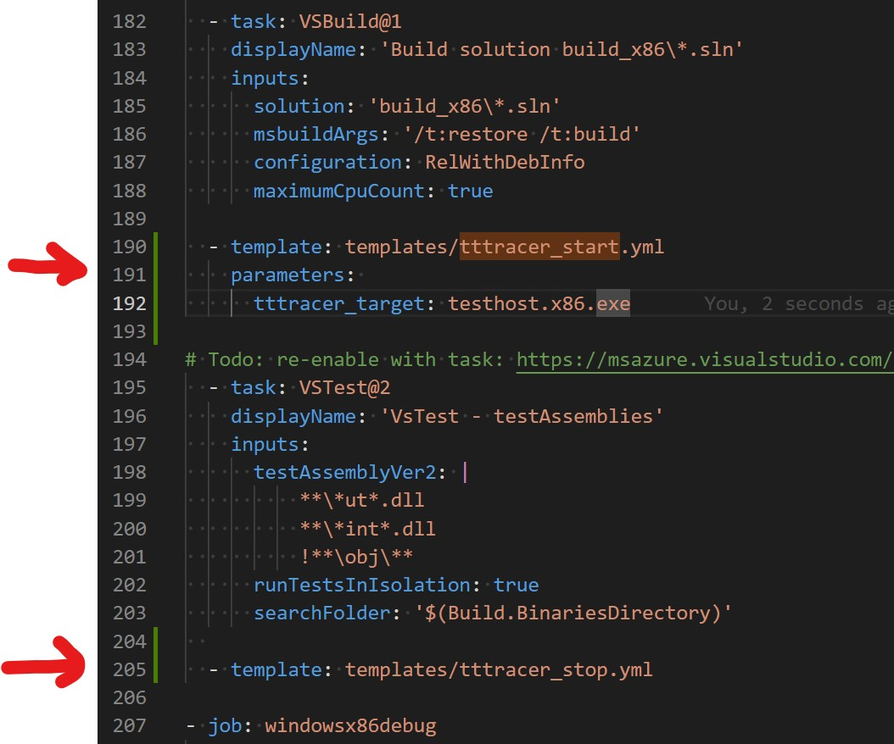
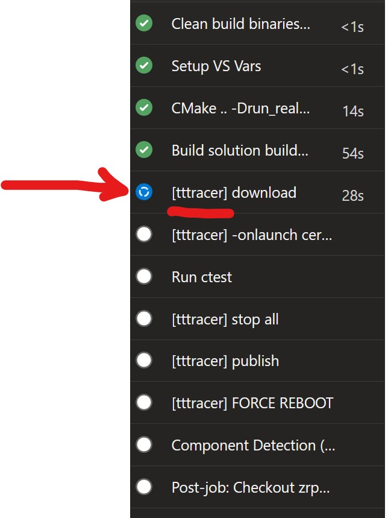
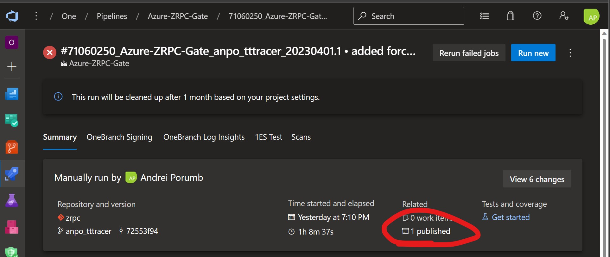
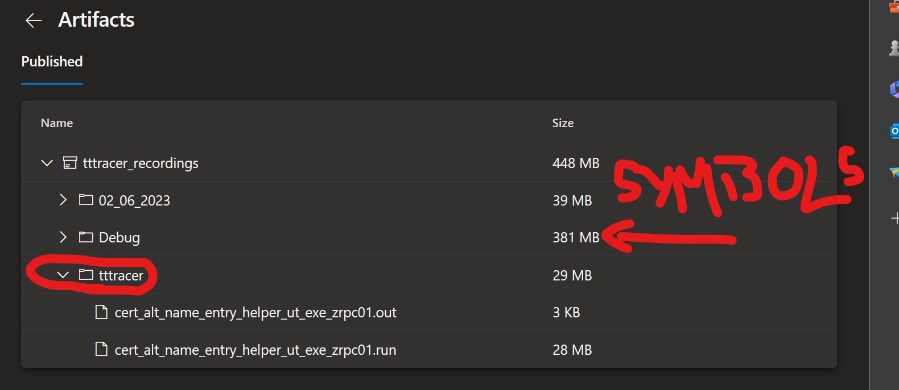

# tttracer in azure pipelines

Sometimes it is **impossible** to get a local repro for a build failure in the gate. 

The solution is to (hopefully) record a trace of the failing test in the gate using tttracer and then downloading that trace (and the binaries) for further analysis locally.

There are 2 templates provided: `tttracer_start.yml` and `tttracer_stop.yml`. They should be used in pairs. See the [README](../README.md) for notes on consuming these templates in your pipeline.

Typical usage 
1) insert `tttracer_start.yml` before the execution of the test
2) insert `tttracer_stop.yml` after the execution of the test

Note: `tttracer_stop.yml` will reboot the build machine.

Here's an example:

```yml
  - template: pipeline_templates/tttracer_start.yml@c_build_tools
    parameters: 
      tttracer_target: cert_alt_name_entry_helper_ut_exe_zrpc.exe

  - task: CmdLine@1
    displayName: 'Run ctest'
    inputs:
      filename: ctest
      arguments: '-C "Debug" -V --output-on-failure'
      workingFolder: 'build_x86'

  - template: pipeline_templates/tttracer_stop.yml@c_build_tools
```

In the above example we are interested in getting a trace for the test `cert_alt_name_entry_helper_ut_exe_zrpc.exe process`.

Here's another example, where `testhost.x86.exe` is recorded:



Note: VsTest tasks require recording of the host process, that is, either `testhost.exe` (for x64) or `testhost.x86.exe` (for x32).


The pipeline will indicate that the templates are active by showing a list of tasks preceeded by [tttracer], like in the picture below:



When tttracer.exe senses the launch of a process, text similar to the one below appears in the pipeline log:

```
Microsoft (R) TTTracer 1.01.11
Release: 1.11.11.0
Copyright (C) Microsoft Corporation. All rights reserved.
Launching '"C:\Program Files\Microsoft Visual Studio\2022\Enterprise\Common7\IDE\Extensions\TestPlatform\Extensions\..\testhost.x86.exe"  --port 49948 --endpoint 127.0.0.1:049948 --role client --parentprocessid 7032 --telemetryoptedin false'
    Recording process (PID:9484) on trace file: C:\a\_work\1\b\tttracer\testhost.x8601.run
```

Once the pipeline ran, the recorded trace and the symbols can be found under "Artifacts":



Here's a typical content of the artifacts container:




