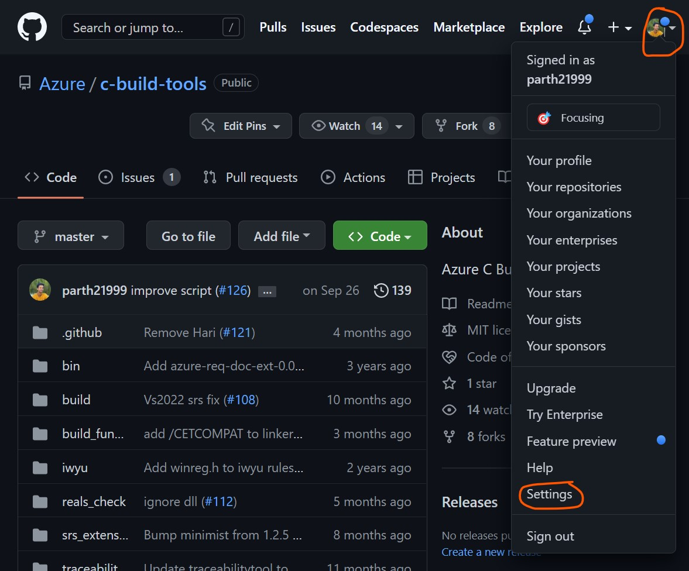
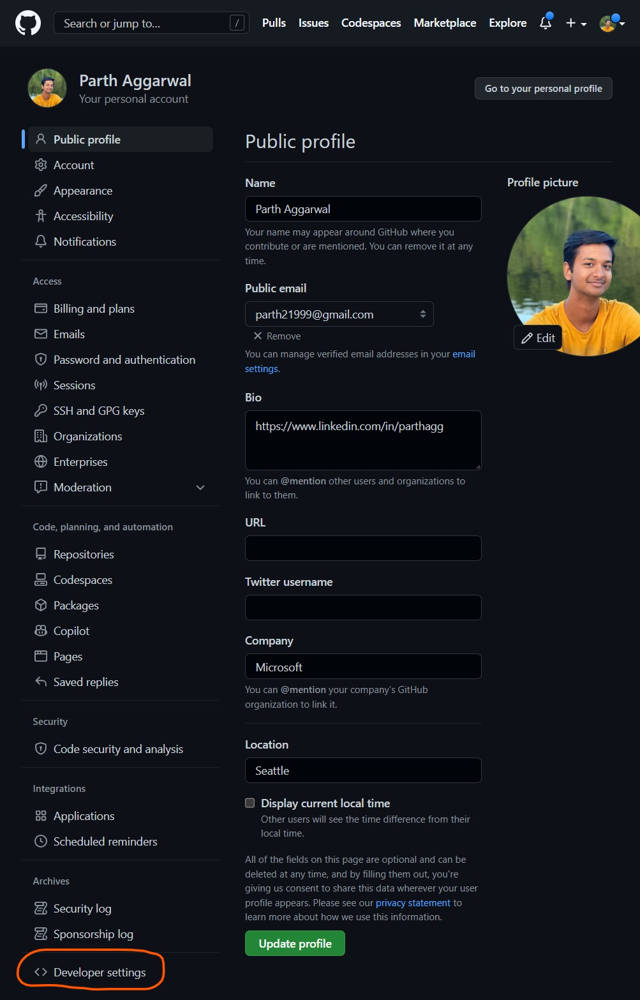
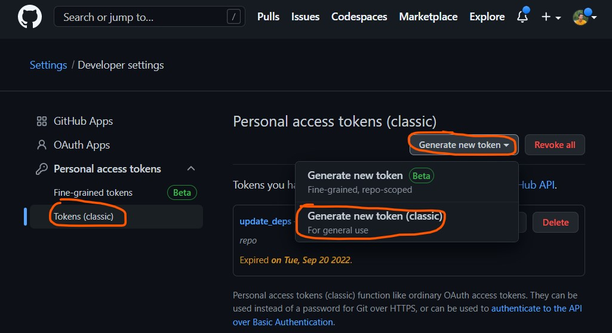
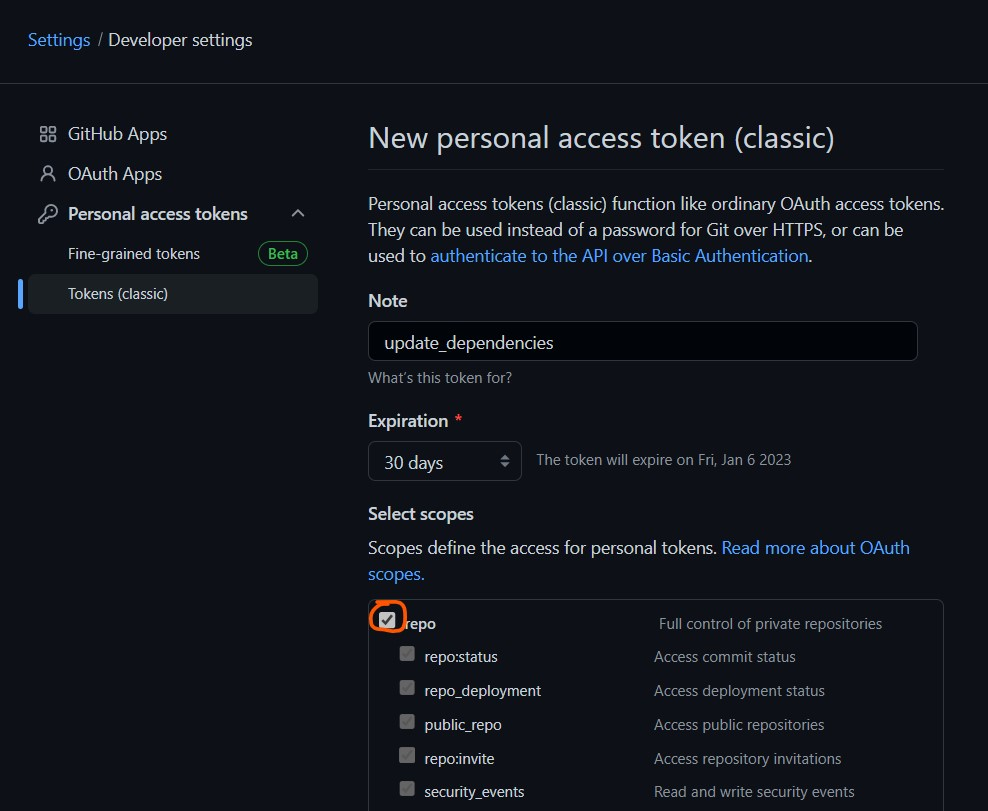
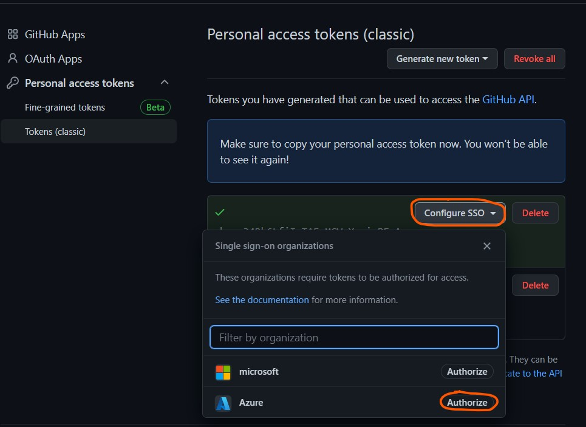

# Dependency Updates Propagation

## build_graph.ps1

This script takes as argument the URL of the repository upto which updates must be propagated.\\
It builds the dependency graph and performs bottom-up level-order traversal to determine the order in which \\
the submodules must be updates such that all submodules contain the latest changes.

### Usage

```
PS> .\build_graph.ps1 [repo_url]
```
## propagate_updates.ps1

Given a root repo and personal access tokens for Github and Azure Devops Services, this script \
builds the dependency graph and propagates updates from the lowest level upto the \
root repo by making PRs to each repo in bottom-up level-order.

### Usage

Run the script in a clean directory:

```
PS> .\{PATH_TO_SCRIPT}\propagate_updates.ps1 -azure_token {token1} -github_token {token2} [-azure_work_item {work_item_id}] [-root {root_repo_url}] 
```
### Arguments:

- `-root`: URL of the repository upto which updates must be propagated.
- `-github_token`: Personal access token for Github. Token must be authorized for use with the Azure organization on Github.
- `-azure_token`: Personal access token for Azure Devops Services. Token must have permissions for Code and Work Items.
- `-azure_work_item`: Work item id of Azure work item that is linked to PRs made to Azure repos. Only required if Azure repos need to be updated.


### ignores.json

`ignores.json` contains a list of repositories that should be ignored while building the dependency graph and should not be updated.

### Obtaining `github_token`

1. Go to `github.com` and sign in.

2. Click on your profile in the top right corner and click on `Settings`:



3. Click on `Developer settings` at the bottom in the left pane:



4. Click on `Tokens (classic)` in the left pane. Click on `Generate new token` and select `Generate new token (classic)` from the drop down:



5. Select `repo` from the list of scopes:



6. Scroll down and click `Generate token`.

7. Copy the generated token and save it.

8. Click on `Configure SSO` and click on `Authorize` next to the `Azure` tab:



### Obtaining `azure_token`

1. Go to `https://msazure.visualstudio.com/` and sign in.

2. Click on the person icon with the gear in the top right corner and select `Personal access tokens` from the menu:


3. Click on `+ New Token`. Give your token a name. Give the token `Read, write,& manage` permission for `Work Items` and `Full` permissions for `Code` :


4. Click `Create` at the bottom.

5. Copy the generated token and save it.