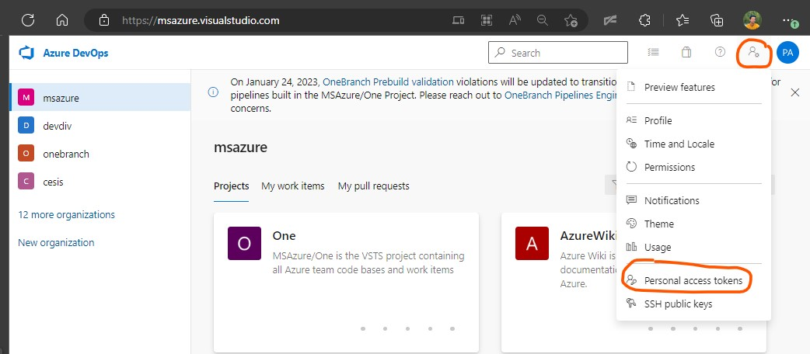
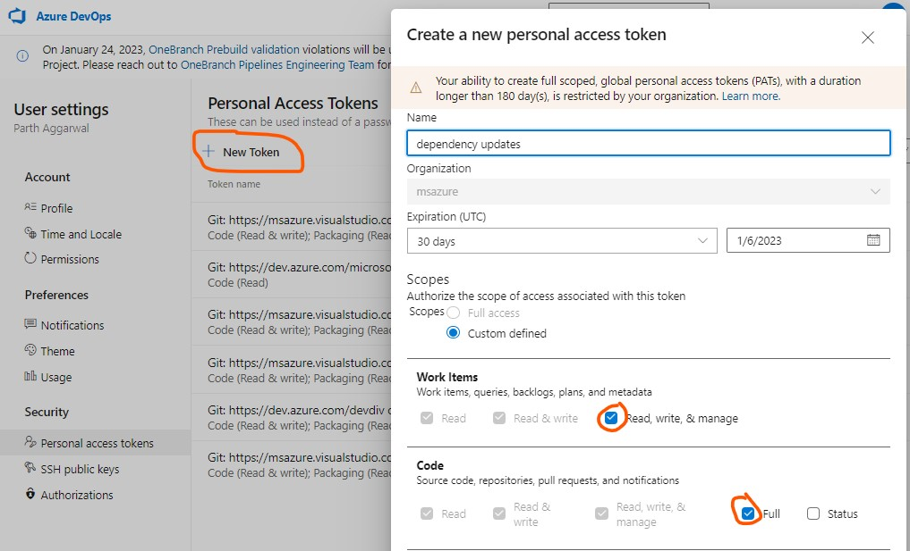

# Dependency Updates Propagation

## Overview

This toolset builds dependency graphs and propagates updates from the lowest level up to root repositories by making PRs to each repo in bottom-up level-order.

## Folder Structure

```
update_deps/
├── propagate_updates.ps1      # Main orchestration script
├── ignores.json               # Repos to exclude from updates
├── helper_scripts/
│   ├── build_graph.ps1        # Builds dependency graph via BFS
│   ├── status_tracking.ps1    # Progress display functions
│   ├── git_operations.ps1     # Local git operations
│   ├── azure_repo_ops.ps1     # Azure DevOps PR operations
│   ├── github_repo_ops.ps1    # GitHub PR operations
│   ├── watch_azure_pr.ps1     # Azure PR policy monitoring
│   ├── watch_github_pr.ps1    # GitHub PR check monitoring
│   ├── install_az_cli.ps1     # Azure CLI setup
│   └── install_gh_cli.ps1     # GitHub CLI setup
```

## propagate_updates.ps1

Given a root repo, this script builds the dependency graph and propagates updates from the lowest level up to the root repo by making PRs to each repo in bottom-up level-order.

### Usage

```powershell
# Using WAM authentication (recommended on Windows)
.\propagate_updates.ps1 -azure_work_item {work_item_id} -root_list {root1}, {root2}, ...

# Using PAT token authentication
.\propagate_updates.ps1 -azure_token {your_pat_token} -azure_work_item {work_item_id} -root_list {root1}, {root2}, ...

# Force a full graph rebuild (ignores known_graph.json)
.\propagate_updates.ps1 -azure_work_item {work_item_id} -ForceBuildGraph -root_list {root1}, {root2}, ...
```

### Arguments

| Argument | Required | Description |
|----------|----------|-------------|
| `-root_list` | Yes | Comma-separated list of URLs of the repositories up to which updates must be propagated |
| `-azure_work_item` | Yes | Work item ID to link to PRs made to Azure repos |
| `-azure_token` | No | Personal access token for Azure DevOps. If not provided, WAM (Web Account Manager) authentication is used |
| `-poll_interval` | No | Seconds between status polls during PR watch (default: 15) |
| `-ForceBuildGraph` | No | Force a full graph rebuild even if the known graph matches |
| `-NoCloseFailedPr` | No | Keep the PR open if it fails (default: close/abandon failed PRs) |

## build_graph.ps1

This script takes a list of repository URLs and builds the dependency graph. It performs bottom-up level-order traversal to determine the order in which submodules must be updated.

### Usage

```powershell
.\helper_scripts\build_graph.ps1 -root_list {root1}, {root2}, ...
```

## Prerequisites

### Automatic Setup

The script automatically handles most setup tasks:

- **Azure CLI**: Automatically installed if not present (Windows only)
- **GitHub CLI**: Automatically installed if not present (Windows only)
- **Azure DevOps extension**: Automatically installed for Azure CLI
- **Azure authentication**: Uses WAM (Web Account Manager) automatically if `-azure_token` is not provided
- **GitHub authentication**: Prompts for `gh auth login` if not already authenticated

### Manual Setup (if automatic installation fails)

#### Azure CLI

1. Download and install the Azure CLI from [here](https://docs.microsoft.com/en-us/cli/azure/install-azure-cli).

2. The azure-devops extension will be automatically installed when you run the script. Alternatively, you can install it manually:
   ```powershell
   az extension add --name azure-devops
   ```

#### GitHub CLI

1. Download the latest version of GitHub CLI from [here](https://cli.github.com/) and install it.

2. Authenticate with GitHub CLI (the script will prompt you if needed):
   ```powershell
   gh auth login
   ```
   Follow the prompts:
   - `What account do you want to log into?` : Select `GitHub.com`
   - `What is your preferred protocol for Git operations?` : Select `HTTPS`
   - `Authenticate Git with your GitHub credentials?` : Enter `Y`
   - `How would you like to authenticate GitHub CLI?` : Select `Login with a web browser`
   - Select the `Azure` organization on the authentication page.

### Azure DevOps PAT Token (Optional)

If WAM authentication doesn't work in your environment, you can use a Personal Access Token instead:

1. Go to `https://msazure.visualstudio.com/` and sign in.

2. Click on the person icon with the gear in the top right corner and select `Personal access tokens` from the menu:



3. Click on `+ New Token`. Give your token a name. Give the token `Read, write, & manage` permission for `Work Items` and `Full` permissions for `Code`:



4. Click `Create` at the bottom.

5. Copy the generated token and pass it using `-azure_token {your_token}`.

## Configuration

### ignores.json

`ignores.json` contains a list of repository names that should be ignored while building the dependency graph and should not be updated.

Example:
```json
[
    "repo-to-ignore-1",
    "repo-to-ignore-2"
]
```

## Pipeline YAML Ref Updates

### Background

Each consuming repo references c-build-tools pipeline templates via `resources.repositories` with a pinned `ref:` SHA:

```yaml
resources:
  repositories:
  - repository: c_build_tools
    type: github
    name: azure/c-build-tools
    endpoint: github.com_azure
    ref: a479dd2fd437d3a0adf2010b22d2c944ea8e6047
```

When propagating updates, the script updates both the `deps/c-build-tools` submodule pointer AND the `ref:` SHA in `build/*.yml` pipeline files so they stay in sync.

### Azure DevOps Limitation: ref must be inline

The `ref:` field in `resources.repositories` only supports [template expressions](https://learn.microsoft.com/en-us/azure/devops/release-notes/2022/sprint-212-update#template-expressions-in-repository-resource-definition) (`${{ }}`) with **parameters** and **system predefined variables**. It does **not** support YAML-defined variables, including those loaded from variable template files.

We attempted to externalize the SHA into a separate file (`deps/c_build_tools_ref.yml`) and reference it via `${{ variables.c_build_tools_ref }}`, but the value silently fell back to the default branch (`master`) at compile time.

Per the Sprint 212 release notes:
> "you can use `parameters` and system predefined variables, but you **cannot use YAML or Pipelines UI-defined variables**"

A feature request has been filed to support variable template values in `ref:`: https://dev.azure.com/mseng/AzureDevOps/_workitems/edit/2371096

### Impact on Auto-Approve

Because the SHA must be hardcoded inline in `build/*.yml`, propagation PRs touch both `deps/` files and pipeline YAML files.

**GitHub repos**: Auto-approve policies use `titleContains: [autogenerated]` combined with `filesMatchPattern` to auto-approve these PRs without manual review.

**ADO repos**: ADO branch policies do not support title-based conditions. The "Required reviewers" policy uses file path patterns, but cannot conditionally approve based on PR metadata. As a result, **propagation PRs to ADO repos that include pipeline YAML changes will require sign-off from another team member**.
