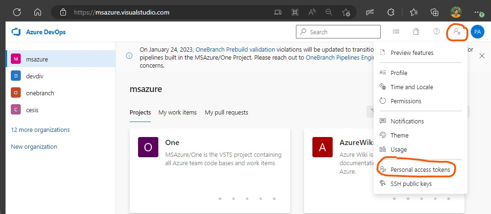

# Dependency Updates Propagation

## build_graph.ps1

This script takes as argument the URL of the repository upto which updates must be propagated.\\
It builds the dependency graph and performs bottom-up level-order traversal to determine the order in which \\
the submodules must be updates such that all submodules contain the latest changes.

### Usage

```
PS> .\build_graph.ps1 [repo_url]
```
## propagate_updates.ps1

Given a root repo, this script builds the dependency graph and propagates updates from the lowest level upto the \
root repo by making PRs to each repo in bottom-up level-order.

## Prerequisites

### Obtaining `azure_token`

1. Go to `https://msazure.visualstudio.com/` and sign in.

2. Click on the person icon with the gear in the top right corner and select `Personal access tokens` from the menu:



3. Click on `+ New Token`. Give your token a name. Give the token `Read, write,& manage` permission for `Work Items` and `Full` permissions for `Code` :


4. Click `Create` at the bottom.

5. Copy the generated token and save it.

### Installing GitHub CLI

1. Download the latest version of GitHub CLI from [here](https://cli.github.com/) and install it.

2. Authenticate with GitHub CLI using the command `gh auth login` and follow the instructions.
 - `What account do you want to log into?` : Select `GitHub.com`
 - `What is your preferred protocol for Git operations?` : Select `HTTPS`
 - `Authenticate Git with your GitHub credentials?` : Enter `Y`
 - `How would you like to authenticate GitHub CLI?` : Select `Login with a web browser`

### Usage

Run the script in a clean directory:

```
PS> .\{PATH_TO_SCRIPT}\propagate_updates.ps1 -root {root_repo_url} -azure_token {token}  [-azure_work_item {work_item_id}] 
```
### Arguments:

- `-root`: URL of the repository upto which updates must be propagated.
- `-azure_token`: Personal access token for Azure Devops Services. Token must have permissions for Code and Work Items.
- `-azure_work_item`: Work item id of Azure work item that is linked to PRs made to Azure repos. Only required if Azure repos need to be updated.


### ignores.json

`ignores.json` contains a list of repositories that should be ignored while building the dependency graph and should not be updated.
